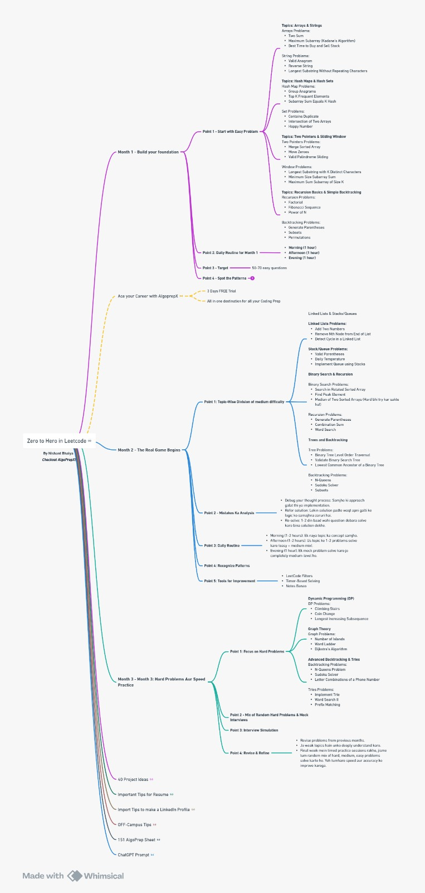

# 🧭 DSA Progress Roadmap

Here's my progress chart for practicing DSA daily.

---

## ✅ Problems Solved

### ✅ Arrays

- [x] 1. Two Sum
- [x] 53. Maximum Subarray
- [x] 121. Best Time to Buy and Sell Stock

### ✅ Strings
- [x] 242. Valid Anagram
- [x] 344. Reverse String
- [x] 3. Largest substring without repeating characters

- [ ] Coming soon...

### 🔜 Hash maps and Hash sets

## HashSet problems
- [x] 217. Contains Duplicate
- [] 349. Intersection of Two Arrays
- [] 202. Happy Number

## HashMap problems
- [] 49. Group Anagrams
- [] 347. Top K Frequent Elements
- [] 560. Subarray Sum Equals K

